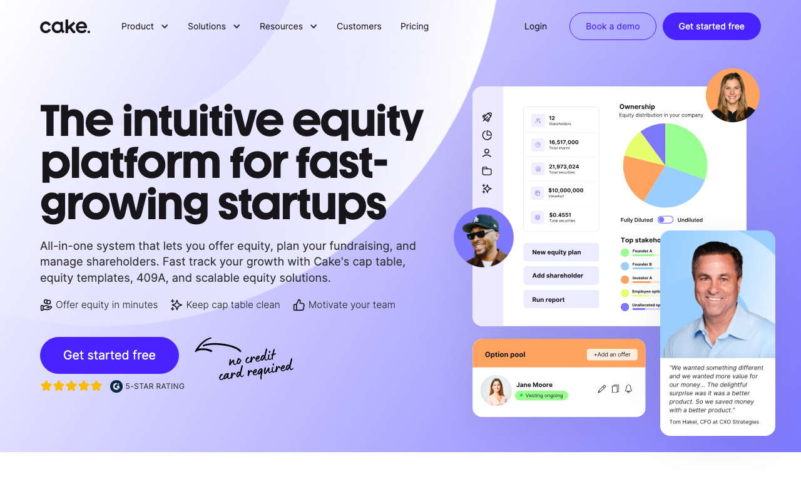

# Perfect Web Clone

<div align="center">

**AI-Powered Web Cloning Tool — Built with Claude Agent SDK**

*Claude Code for web cloning. A vertical AI agent with 40+ specialized tools.*

English | [中文](./docs/cn/README_CN.md) | [日本語](./docs/ja/README_JA.md) | [한국어](./docs/ko/README_KO.md) | [Español](./docs/es/README_ES.md) | [Português](./docs/pt/README_PT.md) | [Deutsch](./docs/de/README_DE.md) | [Français](./docs/fr/README_FR.md) | [Tiếng Việt](./docs/vi/README_VI.md)

[](https://opensource.org/licenses/MIT)
[](https://nextjs.org/)
[](https://react.dev/)
[](https://python.org/)
[](https://fastapi.tiangolo.com/)
[](https://playwright.dev/)
[](https://anthropic.com/)

**Don't want to self-host?** Use the [Perfect Web Clone Skill](https://github.com/ericshang98/perfect-web-clone-skill) directly in Claude Code.

</div>

**A true AI agent** — not just a wrapper around an LLM. Multi-agent collaboration with real tools, self-correction loops, and a complete sandbox environment to build production-ready code from scratch.

Others guess from screenshots. We extract the **real code** — DOM, styles, components, interactions. **Pixel-perfect cloning** that screenshot-based tools simply cannot achieve.

https://github.com/user-attachments/assets/248af639-20d9-45a8-ad0a-660a04a17b68

## Open Source Multi-Agent Architecture

**This entire multi-agent system is open source.** Learn from it, use it, build upon it.

### Why Multi-Agent?

Traditional single-model AI approaches hit a wall with complex tasks. One model trying to handle everything leads to:
- Context window overflow on large pages
- Hallucinations when juggling too many responsibilities
- Slow, sequential processing

Our solution: **Specialized agents working in parallel**, each focused on what it does best.

### Why Not Just Use Cursor / Claude Code / Copilot?

<p align="center">
  
  
  
  <span style="margin: 0 10px;">vs</span>
  
</p>

We tried. Even with the **complete extracted JSON** — full DOM tree, all CSS rules, every asset URL — single-model tools struggle:

| Challenge |    |  Multi-Agent |
|-----------|-------------------------------|---------------------|
| **50,000+ line DOM tree** | ❌ Context overflow, truncates critical parts | ✅ Task distributed to worker agents |
| **3,000+ CSS rules** | ❌ Loses specificity, misses variables | ✅ Parallel processing by workers |
| **Component detection** | ❌ Guesses boundaries, creates monoliths | ✅ Structured workflow ensures consistency |
| **Responsive breakpoints** | ❌ Often hardcodes single viewport | ✅ Extracts all media queries |
| **Hover/animation states** | ❌ Cannot see, cannot reproduce | ✅ Browser automation captures all |
| **Output quality** | ❌ "Close enough" approximation | ✅ Pixel-perfect, production-ready |

> **The core problem**: A 200KB extracted JSON exceeds practical context limits. Even if it fits, a single agent can't maintain coherence when context gets polluted with too much information. The solution isn't smarter agents — it's **task distribution** with reliable workflows.

**Honest limitation**: Complex animations are still hard to extract perfectly — but that's a crawler problem, not an agent problem. The multi-agent architecture itself is capable of **far more than web cloning**. Imagine: automated refactoring, codebase migration, documentation generation, or any task too large for a single agent to handle.

### The Agent + Tools + Sandbox Pattern

```
┌─────────────────────────────────────────────────────────┐
│                    Multi-Agent System                    │
├─────────────────────────────────────────────────────────┤
│                  ┌───────────────┐                      │
│                  │  Main Agent   │                      │
│                  │  (Coordinator)│                      │
│                  └───────┬───────┘                      │
│                          │ distributes tasks            │
│         ┌────────────────┼────────────────┐             │
│         ▼                ▼                ▼             │
│  ┌───────────┐    ┌───────────┐    ┌───────────┐       │
│  │  Worker   │    │  Worker   │    │  Worker   │  ...  │
│  │  Agent 1  │    │  Agent 2  │    │  Agent N  │       │
│  └─────┬─────┘    └─────┬─────┘    └─────┬─────┘       │
│        └────────────────┼────────────────┘              │
│                         ▼                               │
│  ┌─────────────────────────────────────────────────┐   │
│  │                    Tools                         │   │
│  │  • File Operations  • Code Analysis             │   │
│  │  • Browser Control  • API Calls                 │   │
│  └─────────────────────────────────────────────────┘   │
│                         │                               │
│                         ▼                               │
│  ┌─────────────────────────────────────────────────┐   │
│  │              Sandbox (BoxLite)                   │   │
│  │  Isolated execution environment for safe        │   │
│  │  code generation, testing, and preview          │   │
│  └─────────────────────────────────────────────────┘   │
└─────────────────────────────────────────────────────────┘
```

This pattern — **Agent + Tools + Sandbox** — is reusable for any AI agent product:

| Component | Purpose | In Nexting |
|-----------|---------|------------|
| **Main Agent** | Coordinates workflow and distributes tasks | Analyzes page, spawns workers, merges results |
| **Worker Agents** | Execute subtasks with scoped permissions | Process sections in parallel, isolated context |
| **Tools** | Capabilities agents can invoke | File I/O, Browser automation, API calls |
| **Sandbox** | Safe execution environment | [BoxLite](https://github.com/boxlite-ai/boxlite) - Embedded micro-VM runtime |

> **BoxLite**: Hardware-level isolated micro-VMs for AI agents. No root access needed, runs OCI containers with true kernel isolation. → [github.com/boxlite-ai/boxlite](https://github.com/boxlite-ai/boxlite)

### Connect With Me

Building something with this architecture? Have questions? Reach out:

[](https://twitter.com/ericshang98)
[](https://github.com/ericshang98)
[](https://discord.gg/HJURzJq3y5)

---

## Table of Contents

- [Open Source Multi-Agent Architecture](#open-source-multi-agent-architecture)
- [Agent Toolkit](#agent-toolkit)
- [Why Nexting?](#why-nexting)
- [Features](#features)
- [Demo](#demo)
- [Getting Started](#getting-started)
- [Architecture](#architecture)
- [API Reference](#api-reference)
- [Tech Stack](#tech-stack)
- [Contributing](#contributing)
- [License](#license)

## Agent Toolkit

Built on **[Claude Agent SDK](https://docs.anthropic.com/en/docs/agents-and-tools/claude-agent-sdk)** — the same foundation as Claude Code. This isn't a chatbot with API calls; it's a **real agent** that thinks, plans, executes, and self-corrects in an isolated sandbox.

### 40+ Tools Across 10 Categories

| Category | Tools | Purpose |
|----------|-------|---------|
| **File Operations** | `read_file`, `write_file`, `edit_file`, `delete_file`, `rename_file`, `create_directory` | CRUD operations on project files |
| **Search & Discovery** | `glob`, `grep`, `ls`, `search_in_file`, `search_in_project` | Find files and content (ripgrep-powered) |
| **Task Management** | `todo_read`, `todo_write`, `task`, `get_subagent_status` | Track progress, spawn sub-agents |
| **System Execution** | `bash`, `run_command`, `shell` | Run any command in sandbox |
| **Network** | `web_fetch`, `web_search` | Fetch URLs, search the web |
| **Terminal** | `create_terminal`, `send_terminal_input`, `get_terminal_output`, `install_dependencies`, `start_dev_server` | Manage multiple terminal sessions |
| **Preview** | `take_screenshot`, `get_console_messages`, `get_preview_dom`, `get_preview_status` | Inspect live preview state |
| **Diagnostics** | `verify_changes`, `diagnose_preview_state`, `analyze_build_error`, `get_comprehensive_error_snapshot` | Debug and validate |
| **Self-Healing** | `start_healing_loop`, `verify_healing_progress`, `stop_healing_loop` | Auto-fix build errors |
| **Source Query** | `list_saved_sources`, `get_source_overview`, `query_source_json` | Query extracted website data |

### Design Philosophy

```
┌─────────────────────────────────────────────────────────────────────────────┐
│                         Frontend (localhost:3100)                            │
│  ┌─────────────────┐   ┌─────────────────┐   ┌─────────────────────────┐   │
│  │   Chat Panel    │   │    Code IDE     │   │        Preview          │   │
│  │    (Agent)      │   │    (Monaco)     │   │       <iframe>          │   │
│  └────────┬────────┘   └────────┬────────┘   │  src="localhost:8080"   │   │
│           │ Agent              │ User        └────────────┬────────────┘   │
│           │ writes code        │ writes code              │ loads directly │
│           └─────────┬──────────┘                          │                │
│                     ▼                                     │                │
│  ┌──────────────────────────────────────┐                 │                │
│  │           useBoxLite hook            │                 │                │
│  │  writeFile(path, content)            │                 │                │
│  │           ↓                          │                 │                │
│  │  sendMessage({                       │                 │                │
│  │    type: "write_file",               │                 │                │
│  │    payload: { path, content }        │                 │                │
│  │  })                                  │                 │                │
│  └──────────────────┬───────────────────┘                 │                │
└─────────────────────┼─────────────────────────────────────┼────────────────┘
                      │ WebSocket :5100                     │ HTTP :8080
                      ▼                                     │
┌─────────────────────────────────────────────────────────────────────────────┐
│                         Backend (localhost:5100)                             │
│  ┌──────────────────────────────────────┐                 │                │
│  │       BoxLiteSandboxManager          │                 │                │
│  │                                      │                 │                │
│  │  write_file(path, content):          │                 │                │
│  │           ↓                          │    File         │                │
│  │  Writes to disk:                     │    Watcher      │                │
│  │  /tmp/boxlite-sandboxes/             │        ↓        │                │
│  │    {sandbox_id}/                     │                 │                │
│  │      src/App.jsx                     │                 │                │
│  │      src/main.jsx                    │                 │                │
│  │      ...                             │                 │                │
│  └──────────────────┬───────────────────┘                 │                │
│                     │                                     │                │
│                     ▼                                     ▼                │
│  ┌──────────────────────────────────────────────────────────────────────┐  │
│  │                      Vite Dev Server (npm run dev)                    │  │
│  │  - Watches file changes                                              │  │
│  │  - Auto HMR (Hot Module Replacement)                       WebSocket │  │
│  │  - Port: 8080                                                  HMR ──┼──┘
│  └──────────────────────────────────────────────────────────────────────┘  │
└─────────────────────────────────────────────────────────────────────────────┘
```

**What makes this different from ChatGPT/Claude chat?**
- **Persistent state**: Agent remembers context across the entire session
- **Tool chaining**: Can execute 10+ tools in sequence without human intervention
- **Self-correction**: Detects errors, diagnoses root cause, fixes automatically
- **Live preview**: Sees actual rendered output via real Vite dev server, not just code

## Why Nexting?

### Screenshot Tools vs Code Extraction

Most AI cloning tools look at your page like a picture and **guess** the code. We read the **actual source** — that's why our output is production-ready, not a rough approximation.

| Screenshot-Based Tools | Nexting |
|------------------------|---------|
| AI interprets pixels → guesses layout | Extracts real DOM → analyzes CSS |
| Hardcoded pixel values | Responsive with flexible units |
| Dead interactions | Living hover effects & animations |
| Divs all the way down | Semantic HTML preserved |
| Unmaintainable output | Clean, modular components |

## Features

### Web Extractor
- **Full Page Capture** - Extract complete DOM structure, CSS styles, and assets using Playwright
- **Theme Detection** - Automatically detect and capture both light and dark themes
- **Component Analysis** - AI-powered component boundary detection
- **Tech Stack Analysis** - Identify frameworks and libraries used on the page
- **Asset Extraction** - Download images, fonts, and other resources

### Clone Agent
- **Multi-Agent Architecture** - Specialized agents work in parallel for faster, more accurate results
- **AI Code Generation** - Claude generates production-ready code from extracted data
- **Live Preview** - Real-time code preview with BoxLite sandbox
- **Framework Support** - Export to React, Next.js, Vue, or plain HTML

### Multi-Agent System

Traditional single-model approaches fail on complex pages — not because the model isn't smart enough, but because the task is too large. Our multi-agent system solves this through **task distribution**:

| Agent | Responsibility |
|-------|----------------|
| **Main Agent** | Analyzes the page, divides work into subtasks, spawns worker agents, and merges their outputs into coherent code. |
| **Worker Agents** | Execute subtasks in parallel with isolated context. Each worker has scoped permissions and focused responsibility. |

**Why this works**: Instead of one agent drowning in 200KB of context, workers each handle manageable chunks. The structured workflow prevents context pollution and ensures consistency across the final output.

## 🎬 Examples

### Cake Equity
Cap table & equity management platform clone

| Original | Replica |
|----------|---------|
|  |  |

https://github.com/user-attachments/assets/248af639-20d9-45a8-ad0a-660a04a17b68

## Getting Started

### Prerequisites

- Python 3.11 - 3.12 (recommended)
  > **Windows users**: Python 3.13+ has asyncio compatibility issues with Playwright. Please use Python 3.11 or 3.12.
- Node.js 18+
- Anthropic API Key

### Quick Start

1. **Clone the repository**

```bash
git clone https://github.com/ericshang98/perfect-web-clone.git
cd perfect-web-clone
```

2. **Backend Setup**

<details>
<summary><b>macOS / Linux</b></summary>

```bash
cd backend

# Copy environment file and add your API key
cp ../.env.example .env
# Edit .env and add your ANTHROPIC_API_KEY

# Start the server (auto-installs dependencies)
sh start.sh
```

</details>

<details>
<summary><b>Windows</b></summary>

```cmd
cd backend

# Copy environment file and add your API key
copy ..\.env.example .env
# Edit .env and add your ANTHROPIC_API_KEY

# Start the server (auto-installs dependencies)
start.bat
```

</details>

3. **Frontend Setup**

```bash
cd frontend

# Install dependencies
npm install

# Configure environment (optional)
# macOS/Linux: cp ../.env.example .env.local
# Windows: copy ..\.env.example .env.local

# Start development server
npm run dev
```

4. **Open the Application**

Navigate to [http://localhost:3100](http://localhost:3100) in your browser.

### Usage

#### 1. Extract a Website

1. Go to the **Extractor** page
2. Enter a URL to extract
3. Configure extraction options (viewport, theme, etc.)
4. Click **Analyze** to start extraction
5. Once complete, click **Save to Cache** to store the result

#### 2. Clone with AI

1. Go to the **Agent** page
2. Click **Sources** button to open the source panel
3. Select a cached extraction
4. Chat with the AI to generate code
5. View live preview as the Agent writes code

## Architecture

```
nexting/
├── backend/                 # Python FastAPI backend
│   ├── cache/              # Memory cache for extractions
│   ├── extractor/          # Playwright-based web extractor
│   ├── agent/              # Multi-agent system with Claude
│   ├── boxlite/            # Backend sandbox environment
│   ├── image_proxy/        # Image proxy for CORS handling
│   └── image_downloader/   # Batch image download service
│
├── frontend/               # Next.js frontend
│   ├── src/app/           # App router pages
│   ├── src/components/    # React components
│   │   ├── ui/           # Shadcn/UI components
│   │   ├── landing/      # Landing page sections
│   │   ├── extractor/    # Extractor components
│   │   └── agent/        # Agent chat & preview
│   ├── src/hooks/        # Custom React hooks
│   └── src/lib/          # Utilities and API clients
│
├── docs/                  # Documentation & assets
│   ├── assets/           # Demo videos & images
│   ├── cn/               # Chinese documentation
│   └── ja/               # Japanese documentation
│
└── .env.example          # Environment variables template
```

## API Reference

### Extractor API

| Endpoint | Method | Description |
|----------|--------|-------------|
| `/api/extractor/extract` | POST | Start webpage extraction |
| `/api/extractor/status/{id}` | GET | Poll extraction status |

### Cache API

| Endpoint | Method | Description |
|----------|--------|-------------|
| `/api/cache/store` | POST | Store extraction to cache |
| `/api/cache/list` | GET | List cached extractions |
| `/api/cache/{id}` | GET | Get cached extraction |
| `/api/cache/{id}` | DELETE | Delete cached extraction |

### Agent API

| Endpoint | Method | Description |
|----------|--------|-------------|
| `/api/agent/ws` | WebSocket | AI agent communication |

### BoxLite API

| Endpoint | Method | Description |
|----------|--------|-------------|
| `/api/boxlite/*` | Various | Backend sandbox environment |
| `/api/boxlite-agent/*` | Various | Agent sandbox operations |

## Tech Stack

| Category | Technologies |
|----------|--------------|
| **Frontend** | Next.js 15, React 19, TailwindCSS 4, Shadcn/UI, Three.js |
| **Backend** | FastAPI, Python 3.11+, Playwright, WebSocket |
| **AI** | Claude (Anthropic API), Multi-Agent Architecture |
| **Sandbox** | BoxLite |
| **Styling** | TailwindCSS, CSS Variables, Dark Mode Support |

## Contributing

Contributions are welcome! Please feel free to submit a Pull Request.

1. Fork the repository
2. Create your feature branch (`git checkout -b feature/amazing-feature`)
3. Commit your changes (`git commit -m 'Add amazing feature'`)
4. Push to the branch (`git push origin feature/amazing-feature`)
5. Open a Pull Request

## Star History

[](https://star-history.com/#ericshang98/perfect-web-clone&Date)

## License

This project is licensed under the MIT License - see the [LICENSE](LICENSE) file for details.

---

<div align="center">

**[Nexting](https://github.com/ericshang98/perfect-web-clone)** - Extract the real code, not guesses.

Made with ❤️ by [Eric Shang](https://github.com/ericshang98)

</div>
